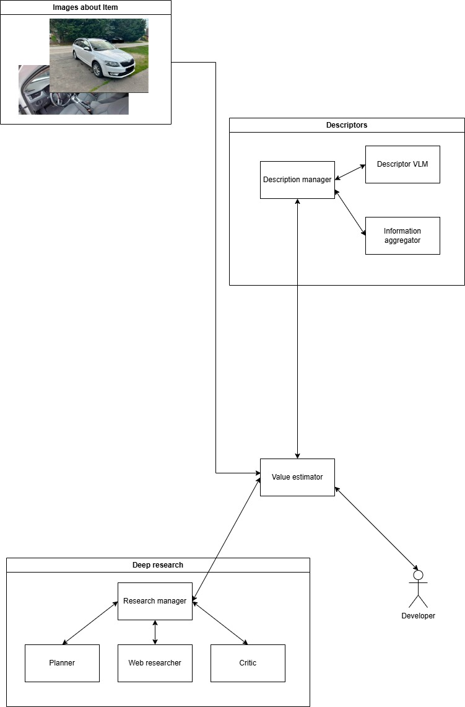

# Collateral Description Agent
Agentic solution for describing an asset from images and estimating its value.

Versions:
- v1: Linear flow with minimal agent behavior
- v2: More agentic, flexible flow

## Prerequisites
- Python 3.10+ (recommended)
- Docker (optional, for containerized run)
- An OpenAI API key and a Tavily API key

## Quickstart

1) Copy the .env template and fill required variables
- Copy .env.sample to .env
- Fill the required values listed in [Env vars](#env-vars)

2) Navigate to the project root
```bash
cd collateral-description-agent
```

### Run with Python
3) (Recommended) Create and activate a [virtual environment](https://docs.python.org/3/library/venv.html)
4) Install dependencies
```bash
pip install -r requirements.txt
```
5) Place images for a single asset into the data/ folder
6) Start telemetry
```bash
python -m phoenix.server.main serve
```
7) Start the app (change version if needed)
```bash
python app-v2/app.py loadenv   # or: python app-v1/app.py loadenv
```
8) Open telemetry at http://localhost:6006

### Run with Docker
3) Build the image
```bash
docker build --tag collateral-agent .
```
4) Run the container, passing .env and mapping the images folder
```bash
docker run -p 6006:6006 --env-file .env \
  -v <folder-containing-images>:/data:ro \
  collateral-agent
```
3. Open http://localhost:6006

> [!TIP]
> The Dockerfile is set up for v2 by default. To use v1, update the version in `Dockerfile` and `start.sh`.

## Env vars

| Variable name  | Description         |
| -------------- | ------------------- |
| OPENAI_API_KEY | OpenAI API key      |
| TAVILY_API_KEY | Tavily API key      |

Place these in .env before running the app.

## Architecture
### V1


### V2
